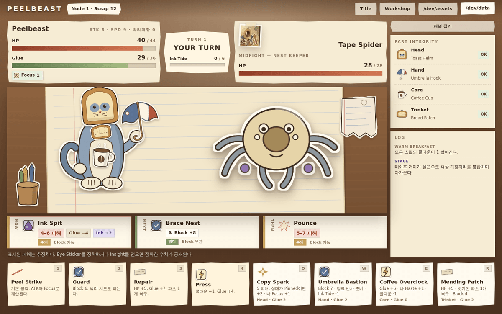

# PEELBEAST

종이 공예 감성의 **파츠 조립형 턴제 로그라이크**.

머리 · 손 · 코어 · 장신구를 붙여 짐승을 만든다. 전투에서 깎이는 건 체력만이 아니다 —
**붙여둔 파츠가 실제로 벗겨져 책상에 떨어지고, 그 순간 스킬과 패시브와 시너지가 함께 사라진다.**

<p align="center">
  
</p>

---

## 현재 구현 범위 (v0.9)

- **화면 10종** — Title / Route Select / Workshop / Battle / Event / Shop / Reward / Result /
  `/dev/assets` / `/dev/data`
- **조립** — 슬롯 4개 × 파츠 3종. 장착이 이미지 레이어·스탯·액티브·패시브·시너지를 동시에 바꾼다.
  호버하면 장착 전후 스탯 델타와 얻는/잃는 스킬·시너지를 보여준다
- **전투** — 1:1 턴제, 적 의도 3개 예고(피해·상태·박리 대상·관통·위험도까지 구조화), 코어 액션 4 + 파츠 스킬 4
- **박리** — 파츠가 뜯겨 낙하해 책상에 남고, 스킬이 잠기고 시너지가 깨진다. 재부착하면 정확히 되돌아온다
- **런** — 루트 2개 × 노드 7개(전투·이벤트·상점·엘리트·보스), Scrap 경제, 리릭 10종,
  HP/Glue 캐리오버, localStorage 이어하기
- **에셋** — 카탈로그 68종, 논리 ID 기반, 누락 시 fallback, 자동 아틀라스 생성
- **결정론** — 시드 RNG. 같은 seed + 같은 입력 = 같은 결과. `?seed=1234`로 고정 가능
- **테스트** — 단위·통합·컴포넌트 143개, E2E 18개, 밸런스 시뮬레이터

전체 설계는 [`docs/00_MASTER_DEVELOPMENT_DOCUMENT.md`](docs/00_MASTER_DEVELOPMENT_DOCUMENT.md)에서 시작한다.

---

## 실행

```bash
npm install
npm run dev          # http://127.0.0.1:5173
```

프로덕션 번들:

```bash
npm run build        # tsc --noEmit && vite build → dist/
npm run preview      # http://127.0.0.1:4173
```

`base: './'` 이므로 빌드 결과는 서브패스나 `file://` 에서도 그대로 열린다.

### 유용한 URL

| URL | 용도 |
|---|---|
| `#/dev/assets` | 에셋 카탈로그 브라우저 + 앵커 조정 도구 |
| `#/dev/data` | 콘텐츠 검증 결과와 라이브 게임 상태 |
| `?seed=1234` | 런을 재현 가능하게 고정 |

---

## 개발

```bash
npm run typecheck    # tsc --noEmit (strict)
npm test             # vitest — 단위 + 통합 + 컴포넌트
npm run test:watch
npm run test:e2e     # playwright (자동으로 build + preview 실행)
```

컨테이너에 설치된 Chromium이 Playwright 버전보다 오래됐다면:

```bash
PLAYWRIGHT_CHROMIUM_PATH=/opt/pw-browsers/chromium npm run test:e2e
```

시각 검수 스크린샷 (1440×900 · 1280×720 · 390×844 × 12화면):

```bash
npm run preview
node scripts/shoot.mjs screenshots
```

헤드리스 조립 앵커 미리보기 (브라우저 없이 앵커 회귀 확인):

```bash
node scripts/preview-assembly.mjs
```

밸런스 시뮬레이션 (전체 런을 배치로 자동 플레이):

```bash
npm run simulate -- --runs 40 --encounters
```

---

## 이미지 교체 절차

**게임 코드는 이미지 파일 경로를 알지 못한다.** 논리 ID로만 요청하므로 교체는 카탈로그 편집이다.

1. 새 이미지를 `public/assets/<category>/` 에 넣는다 (알파 PNG 권장)
2. `src/assets/assetCatalog.ts` 에서 해당 엔트리의 `file`, `width`, `height` 를 고친다
3. `npm run dev` → `#/dev/assets` → 에셋 선택 → 슬라이더로 앵커·스케일·회전 조정 →
   **JSON 복사** → 카탈로그에 붙여넣기
4. `npm run assets:validate` — 파일 존재·크기 일치·알파 유무 검사
5. `npm run assets:atlas && npm run assets:catalog` — 아틀라스와 JSON 미러 갱신

컴포넌트 · CSS · 엔진은 건드리지 않는다.
스펙 전문: [`docs/05_ASSET_CATALOG_SPEC.md`](docs/05_ASSET_CATALOG_SPEC.md)

### 에셋 파이프라인 명령

| 명령 | 하는 일 |
|---|---|
| `npm run assets:sprites` | `scripts/sprite-sources.mjs` → `assets/source/sprites/*.svg` → `public/assets/**/*.png` |
| `npm run assets:sprites -- --regen` | 손으로 고친 SVG를 무시하고 생성기에서 다시 쓴다 |
| `npm run assets:reference` | v0.8 아틀라스를 크롭으로 분해 + 유효성 리포트 |
| `npm run assets:atlas` | `public/assets/generated/atlas.webp` + `atlas.json` 자동 생성 |
| `npm run assets:catalog` | `public/assets/catalog.json` 미러 내보내기 |
| `npm run assets:validate` | 카탈로그 ↔ 디스크 검증 |
| `npm run assets:all` | 위를 순서대로 |

**아틀라스는 산출물이다.** 손으로 편집하지 않는다 — 원본 이미지를 바꾸고 스크립트를 돌린다.
`public/assets/generated/` 는 gitignore된다.

---

## 폴더 구조

```
scripts/              에셋 파이프라인, 시각 QA, 앵커 미리보기
assets/source/
  sprites/            편집 가능한 SVG 원본 (49종)
  reference/          v0.8 레퍼런스 시트 + 추출 리포트
public/assets/        런타임 이미지 + catalog.json + generated/
src/
  app/                셸, 해시 라우팅, 게임 스토어 (엔진 ↔ React)
  assets/             assetTypes / assetCatalog / assetLoader
  game/
    data/             parts, synergies, enemies, intents, statuses, relics,
                      events, shops, routes, balance, validate
    engine/           battleEngine, turnResolver, damageResolver, peelResolver,
                      statusResolver, effectResolver, rewardResolver, describe, rng
    state/            battleState, runState
    systems/          assemblySystem
  components/         assembly / battle / route / event / shop / dev / common
  styles/             base, figure, game, dev
tests/                unit / integration / e2e
docs/                 개발문서 00~10 + analysis/ + legacy/v0.8/ + screenshots/
legacy/v0.8/          v0.8 단일 HTML 빌드 (참조용 보존)
```

### 지켜지는 경계

- 엔진(`src/game/**`)은 DOM을 참조하지 않는다
- UI는 규칙을 다시 계산하지 않는다 — 엔진이 `FxEvent[]`로 무슨 일이 있었는지 알려준다
- 컴포넌트는 이미지 파일 경로를 모른다
- 밸런스 숫자는 `src/game/data/balance.ts` 에만 있다
- `Math.random()` 은 `src/game/**` 어디에도 없다

---

## 알려진 제약

- 스프라이트 48종이 `placeholder` 상태다. 손으로 저작한 벡터이며 최종 아트가 아니다
- 적 3종은 원본 레퍼런스에서 배경 분리에 실패해 새로 저작했다
  (사유는 `scripts/build-reference-cutouts.mjs` 주석)
- 밸런싱 2차 완료(`npm run simulate`) — 전 조합 승률 17.5~82.5 %.
  `ghost/spear/coffee/eye`가 20 pt 뒤지고 방어 빌드 전투가 길다 — `docs/02_GAME_DESIGN.md` §8.6
- 사운드 없음, 튜토리얼 없음
- UI 문구가 한국어로 하드코딩되어 있다 (게임 데이터는 분리됨)
- 레퍼런스 시트의 라이선스가 불명이다. 배포 전 확인이 필요하다
  ([`docs/10_REFERENCE_IMAGE_MAPPING.md`](docs/10_REFERENCE_IMAGE_MAPPING.md) §6)

---

## 로드맵

**P0** 최종 아트 교체(`docs/11_ART_DIRECTION_AND_ASSET_BRIEF.md`) · 밸런싱 2차
**P1** 콘텐츠 확장(파츠 24, 적 8, 이벤트 15, 보스 2) · 튜토리얼 · 사운드 · 시각 회귀 테스트
**P2** 메타 해금 · 도감 · 난이도 단계 · 분기 루트 그래프 · 로컬라이제이션

전문: [`docs/09_ROADMAP.md`](docs/09_ROADMAP.md)

---

## 라이선스

- `assets/source/sprites/` 및 그 래스터 결과물 — CC0-1.0
- `assets/source/reference/legacy-atlas-v0.8.webp` 및 크롭 — **라이선스 불명.**
  v0.8 업로드에서 상속되었으며 내부 참조용으로 취급한다
